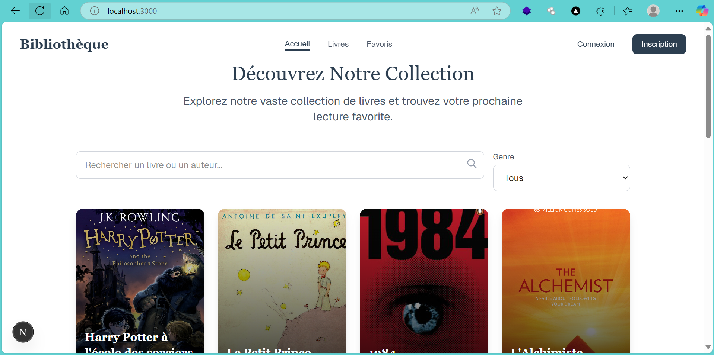
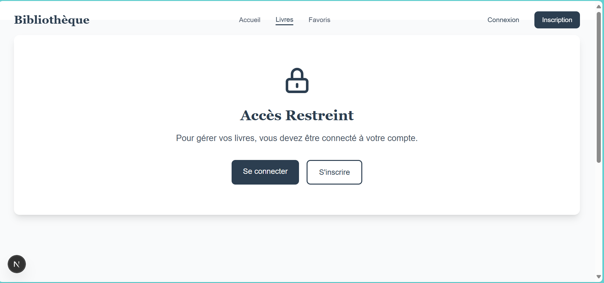
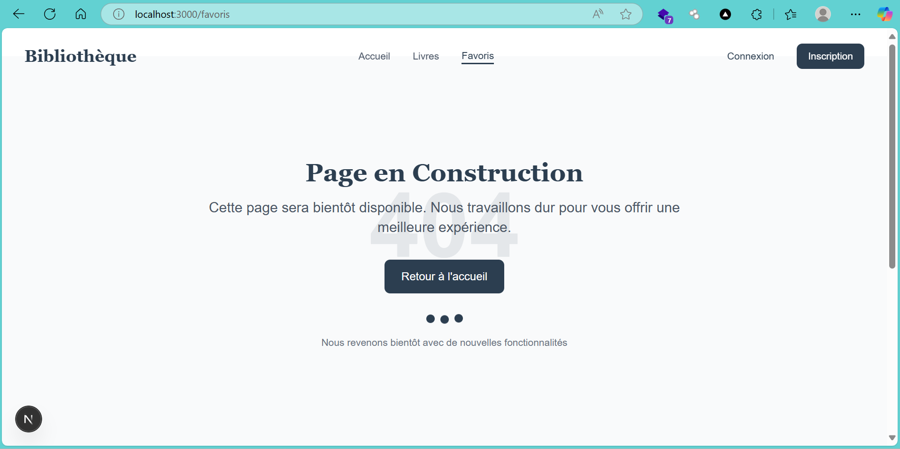
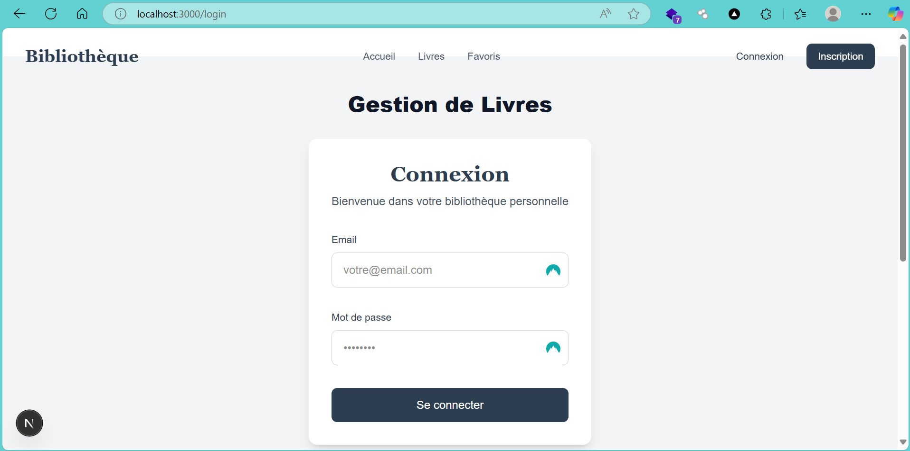
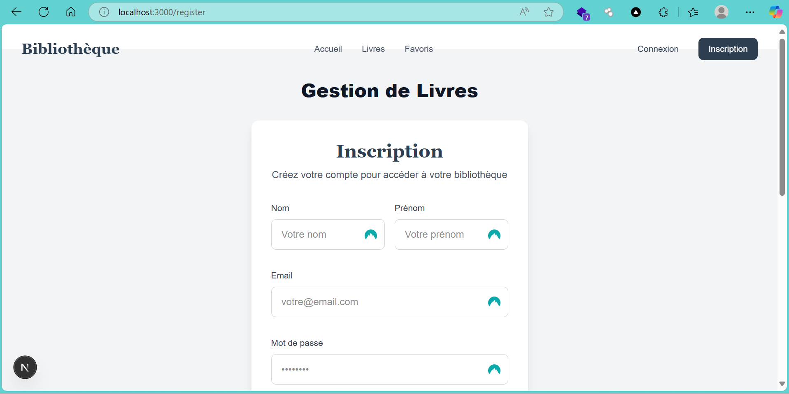
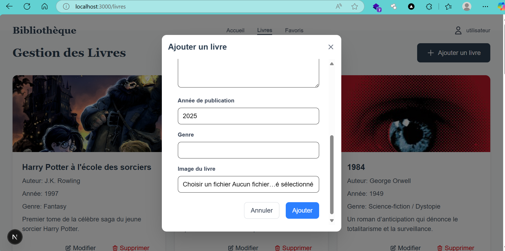
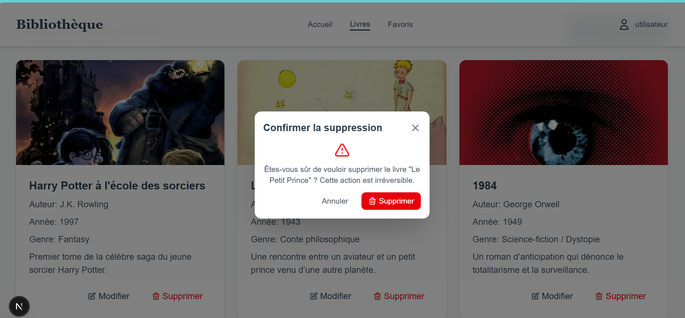

# 📚 Mini Application de Gestion de Livres

Une mini application full-stack permettant aux utilisateurs de **s'inscrire**, **se connecter**, et **gérer une collection de livres** (CRUD) via une interface intuitive.

## 🧩 Fonctionnalités

- 🔐 Authentification (inscription & connexion)
- 📖 Affichage public des livres pour les visiteurs
- 🧑‍💼 Tableau de bord utilisateur avec :
  - ➕ Ajout de livres
  - ✏️ Modification de livres
  - 🗑️ Suppression de livres
  - 📸 Upload d'images pour les livres
- 📦 Architecture full-stack : Next.js (frontend) + Node.js (backend) + MySQL

## 📸 Aperçu










## 🛠️ Technologies utilisées

### Frontend
- **Framework** : Next.js 14
- **Langage** : TypeScript
- **Styling** : Tailwind CSS
- **État** : React Hooks
- **HTTP Client** : Axios
- **Authentification** : JWT

### Backend
- **Framework** : Node.js avec Express
- **Base de données** : MySQL
- **Authentification** : JWT
- **Sécurité** : Bcrypt
- **Upload** : Multer pour les images

## 🔧 Installation

### 🖥️ Prérequis

- Node.js (version 14 ou supérieure)
- MySQL
- npm ou yarn

### 🚀 Installation du Backend

1. **Cloner le dépôt**
   ```bash
   git clone https://github.com/bibalaye/Mini_projet_gestion_des_livres_EDACY.git
   cd livres-backend-edacy
   ```

2. **Installer les dépendances**
   ```bash
   npm install
   ```

3. **Configurer la base de données**
   - Créer une base de données MySQL
   - Copier le fichier `.env.example` en `.env`
   - Configurer les variables d'environnement :
   ```
   DB_HOST=localhost
   DB_USER=votre_utilisateur
   DB_PASSWORD=votre_mot_de_passe
   DB_NAME=nom_de_la_base
   JWT_SECRET=votre_secret_jwt
   FRONTEND_URL=http://localhost:3000
   PORT=5000
   ```

4. **Démarrer le serveur**
   ```bash
   npm run dev
  ```
### 🚀 Installation de la base de données

1. **Méthode par ligne de commande**

   a. **Accéder au dossier de configuration**
   ```bash
   cd livres-backend-edacy/config
   ```

   b. **Exécuter le script d'initialisation de la base de données**
   ```bash
   mysql -u votre_utilisateur -p < init.sql
   ```
   Ce script crée la base de données `livres_db` et les tables nécessaires (users, livres) avec leurs structures.

   c. **Charger les données initiales (optionnel)**
   ```bash
   mysql -u votre_utilisateur -p livres_db < data_livres.sql
   ```
   Ce script insère des données d'exemple dans les tables pour faciliter les tests.

2. **Méthode avec interface graphique (WAMP, XAMPP, Laragon)**

   a. **Ouvrir phpMyAdmin**
   - Dans WAMP : cliquez sur l'icône WAMP dans la barre des tâches → phpMyAdmin
   - Dans XAMPP : ouvrez le panneau de contrôle XAMPP → cliquez sur "Admin" à côté de MySQL
   - Dans Laragon : cliquez sur "Database" dans le menu principal

   b. **Créer une nouvelle base de données**
   - Créez une base de données nommée `livres_db`

   c. **Importer les scripts SQL**
   - Sélectionnez la base de données `livres_db`
   - Cliquez sur l'onglet "Importer"
   - Parcourez et sélectionnez d'abord le fichier `init.sql` du dossier `livres-backend-edacy/config`
   - Cliquez sur "Exécuter"
   - Répétez l'opération avec le fichier `data_livres.sql` pour importer les données d'exemple

Note: Assurez-vous que votre serveur MySQL est en cours d'exécution avant d'exécuter ces commandes ou d'utiliser l'interface graphique.

### 🎨 Installation du Frontend

1. **Accéder au dossier frontend**
   ```bash
   cd ../livres-frontend-edacy
   ```

2. **Installer les dépendances**
   ```bash
   npm install
   ```

3. **Configurer les variables d'environnement**
   - Créer un fichier `.env.local`
   - Ajouter les variables :
   ```
   NEXT_PUBLIC_API_URL=http://localhost:5000/api
   NEXT_PUBLIC_BACKEND_URL=http://localhost:5000
   ```

4. **Démarrer l'application**
   ```bash
   npm run dev
   
   5. **Connexion à l'application**
      - Vous pouvez vous connecter avec les identifiants suivants :
      ```
      Email: test@test.com
      Mot de passe: test123
      ```
   ```

## 📁 Structure du Projet

```
projet/
├── livres-backend-edacy/
│   ├── controllers/     # Logique métier
│   ├── middleware/      # Middleware (auth, upload)
│   ├── models/         # Modèles de données
│   ├── routes/         # Routes API
│   ├── uploads/        # Images des livres
│   └── index.js        # Point d'entrée
│
└── livres-frontend-edacy/
    ├── app/            # Pages Next.js
    │   ├── components/ # Composants réutilisables
    │   ├── hooks/      # Hooks personnalisés
    │   ├── lib/        # Utilitaires
    │   └── types/      # Types TypeScript
    └── public/         # Fichiers statiques
```

## 🔐 API Endpoints

### Authentification
- `POST /api/auth/register` - Inscription
- `POST /api/auth/login` - Connexion
- `GET /api/auth/me` - Profil utilisateur

### Livres
- `GET /api/livres` - Liste des livres
- `GET /api/livres/:id` - Détails d'un livre
- `POST /api/livres` - Créer un livre
- `PUT /api/livres/:id` - Modifier un livre
- `DELETE /api/livres/:id` - Supprimer un livre
- `GET /api/livres/me/livres` - Livres de l'utilisateur

## 👨‍💻 Auteur

Abiboulaye Sy

---

